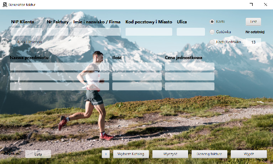
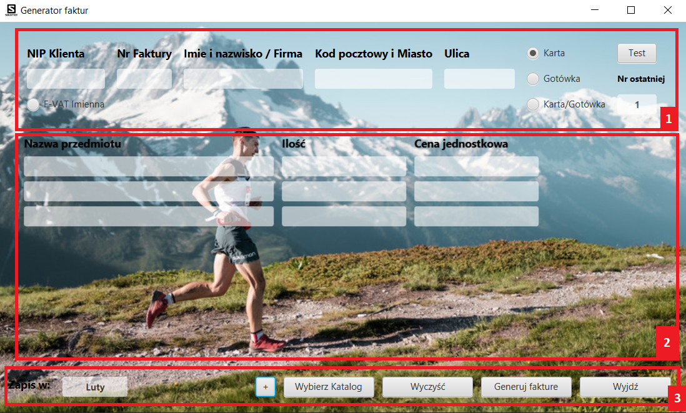
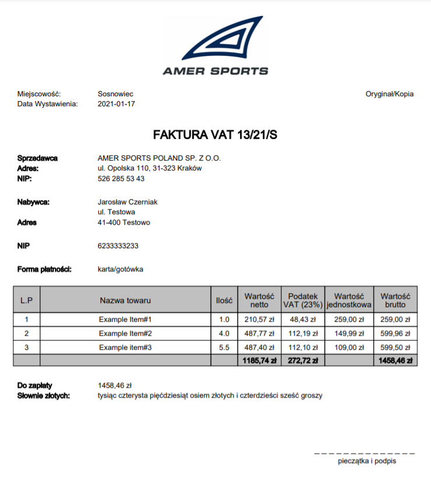
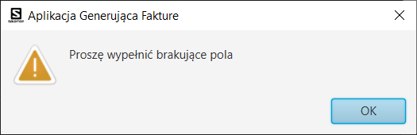
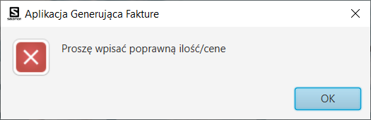
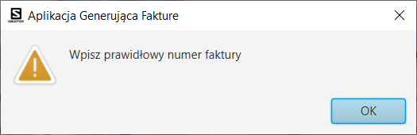
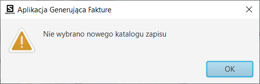

# Invoice generator
> 
This application allows you to generate invoices for a Salomon store. It only needs the most important information. It makes work easier.

## Table of contents
* [General info](#general-info)
* [Technologies](#technologies)
* [Features](#features)
* [Status](#status)
* [Guide](#guide)
* [Contact](#contact)

## General info

Invoice generator is the result of my java programming language learning. 
Plus, she became useful for my previous employer. 
Thanks to it, you can easily generate an invoice and have full control over their numbering as well as the saving path. 
By making small changes, I can easily adapt the generator to your activity.



## Technologies
* Java - version 11.0.8
* iText - version 5.1.2
* JavaFX - version 11.0.2


## Code Examples
RadioButtons in sample.fxml:
```
   <RadioButton GridPane.columnIndex="6" GridPane.rowIndex="1" alignment="CENTER" text="Karta" toggleGroup="$paymentType" selected="true"/>
   <RadioButton GridPane.columnIndex="6" GridPane.rowIndex="2" alignment="CENTER" text="Gotówka" toggleGroup="$paymentType"/>
   <RadioButton GridPane.columnIndex="6" GridPane.rowIndex="3" alignment="CENTER" text="Karta/Gotówka" toggleGroup="$paymentType"/>
```
Enum type to select payment
```
public enum PaymentType {
    card,money,both,noSelected
}
```
Select payment in controller
```
    private String paymentMethod() {
        if(paymentMethod == PaymentType.both)
            return "karta/gotówka";
        else if (paymentMethod == PaymentType.money)
            return "gotówka";
        else
            return "karta";
    }
```
Use information about payment to generate invoice
```
public class PDFGenerator {
    (...)
    private final PaymentType paymentMethod;
    (...)
```
## Features
List of features ready and TODOs for future development
* Generating an invoice (logo,information,items,resume)
* Simple GUI
* Info about errors in dialog
* Variable number of items and add more
* Useful user function (clear,test,exit)
* Remember information about save path and number last invoice
* Usable .jar version to the client

To-do list:
* Webservice with BIR (REGON) to get information by NIP number
* Unit tests

## Status
Project is: in progress (current version can be used)

Possibility of modification for the client.

## Guide

### GUI


GUI application have three segments.

#### 1. Top
Here, we enter the customer's data that will be displayed on the invoice.
Select the type of invoice and the method of payment. 
In addition, we have the option of entering test data and the user receives information about the number of last invoice.
#### 2. Mid
Here, we enter the information about items: name,amount,price per unit.
We can write maximum 16 items and minimum 1 item.


#### 3. Bottom
At the bottom we see information about last folder to save path.
#####Buttons:
+ "+" Add items to invoice
+ "Wybierz Katalog" - Set new folder to save
+ "Wyczyść" - Clear all text fields
+ "Generuj Fakture" - Generate Invoice
+ "Wyjdź" - Exit application
### Invoice


### Dialogs
##### Empty important information


##### Wrong amount/price (no float)

##### Wrong facture number (no int)

##### Don't set new save path

##### Wrong NIP number (too many/too few numbers)

## Inspiration

The application was written while I was working in a sports store. I had to create invoices in an ineffective way.
I decided to simplify the task for myself and my colleagues.

In my project I used NumberTranslation found on the internet.

## Contact
Created by Jarosław Czerniak [@jikoso2](https://github.com/jikoso2) - See my GitHub!